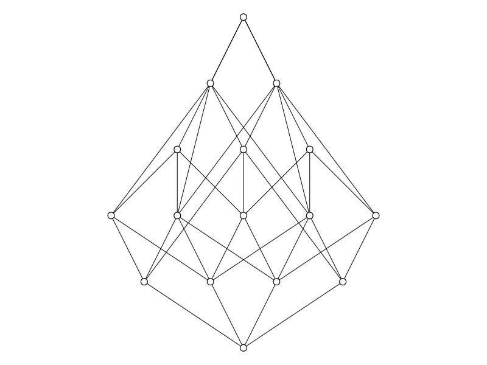

# Tools for the `PJT` Module

These additional tools rely on additional modules (e.g. `SimpleGraphs`).

## `decomposition.jl`

The two main functions in this file are `chain_decomposition` and `antichain_decomposition`. 

* Calling `chain_decomposition(b)` gives a partition of the `b`-bit poset into chains. The number of chains equals the width of the poset.

* Calling `antichain_decomposition(b)` gives a partition of the `b`-bit poset into antichains. The number of antichains equals the height of the poset.

```
julia> cd = chain_decomposition(4)
5-element Vector{Vector{Word}}:
 [0100, 1100]
 [0001, 0101, 0111]
 [0011, 1011]
 [0010, 0110, 1001, 1101]
 [0000, 1000, 1010, 1110, 1111]

julia> [is_chain(c) for c in cd]
5-element Vector{Bool}:
 1
 1
 1
 1
 1

julia> acd = antichain_decomposition(4)
6-element Vector{Vector{Word}}:
 [0001, 0010, 0100, 1000]
 [0011, 0101, 0110, 1010]
 [1011, 1101, 1110]
 [0000]
 [1111]
 [0111, 1001, 1100]

julia> [is_antichain(a) for a in acd]
6-element Vector{Bool}:
 1
 1
 1
 1
 1
 1
```

## `simple_poset.jl`

This file provides that function
`make_simple_poset(b)` to create a `SimplePoset{Word}` of the `b`-bit words. 

```
julia> P = make_simple_poset(4)
SimplePoset (16 elements)

julia> draw(P)
```



We also provide `rank_decomposition(b)` which decomposes the `b`-bit word poset into layers.
```
julia> rank_decomposition(4)
6-element Vector{Vector{Word}}:
 [0000]
 [0001, 0010, 0100, 1000]
 [0011, 0101, 0110, 1010, 1100]
 [0111, 1001, 1110]
 [1011, 1101]
 [1111]
```
These appear to be good antichain decompositions.